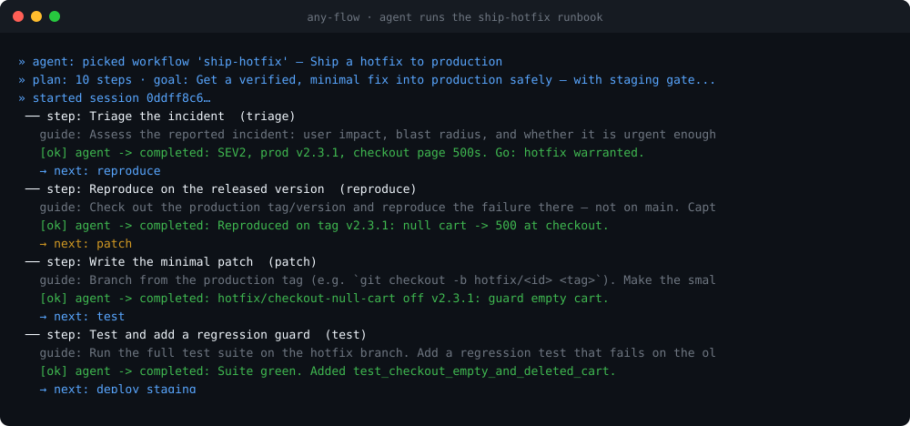

<p align="center">
  
</p>

<h1 align="center">any-flow</h1>

<p align="center">
  <a href="https://github.com/coder0211/any-flow/actions/workflows/ci.yml">
    
  </a>
</p>

<p align="center"><b>MCP-served workflows that guide an AI agent step by step.</b></p>

any-flow is an [MCP](https://modelcontextprotocol.io) server that hands an agent
_flows_: opinionated, ordered procedures for a task. The agent attaches the MCP,
asks for the overview of a flow, then executes it one step at a time — with the
server validating progress and handing back the next step.

The key idea: **any-flow guides, it does not execute.** Each step returns
natural-language instructions, the tools to reach for, and how to know the step
succeeded. Your agent does the actual work with its own tools and reports back.

```
┌─────────┐   list / plan / start / complete_step    ┌───────────────┐
│  Agent  │ ───────────────────────────────────────▶ │  any-flow MCP │
│ (Claude)│ ◀────────── guidance + next step ─────── │  (this repo)  │
└─────────┘                                          └───────────────┘
     │ does the real work with its own tools               │
     └──────── reports result ─────────────────────────────┘
```

## Demo

A scripted agent runs the **`ship-hotfix`** runbook end to end. Watch it fail
staging verification once — the flow refuses to let it reach production and
routes it **back to `patch`** before the gate passes:



Reproduce it yourself: `make demo` (prints the transcript) or `python examples/run_demo.py`.

## Why any-flow?

Modern agents already plan. So why hand them a flow instead of just writing the
steps into a prompt?

- **vs. a prompt / `CLAUDE.md` / system message** — prose guidance is advisory
  and easy to skip under pressure. any-flow's steps are **gated**: the server
  won't hand over the production-deploy step until staging verification is
  reported green, and a failed gate **routes the agent back** instead of forward.
  The procedure is enforced, not merely suggested.
- **vs. a one-shot Skill / template** — a Skill dumps the whole procedure into
  context up front. any-flow uses **progressive disclosure**: the agent reads a
  cheap overview, then pulls each step's detailed guidance only when it gets
  there. Long runbooks don't blow the context budget.
- **vs. an orchestration framework (LangGraph, CrewAI, …)** — those frameworks
  _run_ your graph: they own the control loop and call the model. any-flow
  inverts that — **your agent stays in control** and simply asks for guidance
  over MCP. Nothing to host, no framework lock-in; it drops into any MCP-capable
  agent (Claude Code, Claude Desktop, your own) in one line.
- **The core principle** — any-flow **guides, it never executes.** It has no
  tools of its own, touches no files, calls no models. That keeps flows pure,
  auditable, and safe to run inside any agent — the agent's existing tools and
  permissions are the only thing that acts.

Reach for any-flow when _how_ a task is done matters as much as _whether_ it gets
done: incident runbooks, release procedures, compliance checklists, onboarding
flows — anywhere skipping a step is the expensive failure.

## Architecture

Two layers, kept strictly separate:

- **`anyflow.core`** — the _interfaces_ (`Flow`, `Step`) and the engine
  (`FlowRegistry`, `SessionManager`) every flow implements against. Zero
  dependency on `mcp`, so flows and their contract tests run without a server.
- **`anyflow.flows`** — the _concrete implementations_ you clone, copy, and
  extend. Four working templates ship in the box:
  - `github-page` — the **easiest to try**: hand it a public GitHub URL and it
    goes fetch (public REST API) → build (one self-contained HTML page) → preview.
    A bad or private link stops at the `fetch` gate. See [Try it](#try-it-in-30-seconds).
  - `ship-hotfix` — the flagship: a real **multi-tool release runbook** (triage →
    reproduce → patch → test → staging → verify → prod → monitor) with gates that
    have teeth — a failing staging check routes back to `patch` (and after too
    many tries, hands off to `escalate`), a prod regression routes to `rollback`,
    and `test`/`deploy_prod` are gated on structured artifacts, not prose.
  - `fix-bug` — a smaller **branching** flow (reproduce → locate → fix → verify)
    where a failed `verify` step loops back to `locate`.
  - `refactor-python` — a simple **linear** flow (analyze → plan → apply).

The `anyflow.server` module wires the registry into an MCP server.

### The interfaces

```python
class Step(ABC):
    id: str
    title: str
    max_attempts: int | None = None                                # loop guard; None = unlimited
    on_exhausted: str | None = None                                # step to route to when the guard trips
    def guide(self, context: FlowContext) -> StepGuidance: ...      # required
    def validate(self, result, context) -> Validation: ...          # default: ok
    def route(self, result, context) -> str | None: ...             # default: linear

class Flow(ABC):
    id: str; name: str; goal: str
    steps: list[type[Step]]                                         # execution order
```

`guide` receives a `FlowContext` (prior step results + shared variables), so
guidance can adapt to what happened earlier. `route` lets a flow branch instead
of running strictly linearly. `validate` is where a gate gets **teeth**: report
structured artifacts (JSON — numbers, lists, nested objects) and have `validate`
assert on them (e.g. `results.failed == 0`) instead of trusting a free-text claim.

### MCP tools

| Tool                                      | Purpose                                                             |
| ----------------------------------------- | ------------------------------------------------------------------- |
| `list_workflows()`                        | Discover flows and when to use each.                                |
| `get_workflow_plan(id)`                   | Read a flow's overview before committing (progressive disclosure).  |
| `start_workflow(id)`                      | Begin a session → `session_id` + first step guidance.               |
| `get_current_step(session_id)`            | Re-fetch the current step's guidance.                               |
| `complete_step(session_id, step_id, ...)` | Report a result; validate & advance.                                |
| `get_progress(session_id)`                | A live map: step _N_ of _M_, % done, path taken, per-step attempts. |
| `list_sessions(status=…)`                 | Enumerate stored sessions to resume one (needs a persistent store). |
| `abort_workflow(session_id)`              | Abandon a session.                                                  |

Sessions are **stateful**: the server tracks where each agent is in its flow.
Storage sits behind a `SessionStore` interface (`InMemorySessionStore` by
default) — swap in SQLite/Redis without touching the flow engine.

Every step response also carries a compact **`progress`** block, so the agent
always knows where it is without a second call:

- **Never lose the thread** — `progress` reports the current step's index, the
  ordered `path` taken (loops included), which steps are done, what's left, and
  how many times each step has been entered.
- **Gates can't loop forever** — a `Step` may set `max_attempts`. When a branch
  would re-enter a step past its ceiling (e.g. `patch` keeps failing staging
  verification), the engine refuses to advance. Set `on_exhausted` to a terminal
  step (e.g. `escalate`) to hand off to a human gracefully instead of raising —
  `ship-hotfix` does exactly this rather than ping-ponging a gate indefinitely.
- **Gates with teeth** — `complete_step` accepts **structured artifacts** (JSON:
  numbers, lists, nested objects), and a step's `validate` can assert on them. In
  `ship-hotfix`, `test` is gated on `results={"passed":int,"failed":int}` (any
  failure is rejected) and `deploy_prod` on a captured `rollback_command` — facts
  an agent can't wave away with a vague summary.
- **Resume later** — with a persistent store, `list_sessions()` finds a stranded
  `session_id` so an interrupted run can be picked back up mid-flow.

## Quick start

```bash
python -m venv venv && source venv/bin/activate
pip install -e ".[dev]"     # or: pip install -r requirements.txt
pytest                       # run the engine + example-flow tests
python -m anyflow.server     # start the MCP server over stdio
```

### Try it in 30 seconds

The `github-page` example is a real (tiny) agent driven by the flow: it fetches a
public GitHub repo or user, builds one self-contained HTML page, and previews it —
producing a file you can open.

```bash
python examples/github_page.py https://github.com/psf/requests
# → build/psf-requests.html   (open it in your browser)
```

```text
── Fetch the public GitHub data (fetch)   ✅ Fetched repo psf/requests.
── Build the HTML page (build)            ✅ Wrote build/psf-requests.html.
── Preview and verify (preview)           ✅ Open it in a browser.
🎉 done → build/psf-requests.html
```

Give it a bad or private link and the `fetch` gate stops the flow instead of
building an empty page. Then point your own agent at any-flow and just say
_"make an HTML page from github.com/…"_ — the agent does the fetch/write; the flow
supplies the procedure and the gate.

### Connect it to an agent

Claude Code:

```bash
claude mcp add any-flow -- python -m anyflow.server
```

Claude Desktop (`claude_desktop_config.json`):

```json
{
  "mcpServers": {
    "any-flow": {
      "command": "python",
      "args": ["-m", "anyflow.server"]
    }
  }
}
```

Cursor (`~/.cursor/mcp.json` for all projects, or `.cursor/mcp.json` in a project):

```json
{
  "mcpServers": {
    "any-flow": {
      "command": "python",
      "args": ["-m", "anyflow.server"]
    }
  }
}
```

Then enable **any-flow** under Cursor Settings → MCP.

## Persistence

Sessions are in-memory by default (fine for a single-process stdio server). For
a long-running or multi-process server, persist them in SQLite by pointing
`ANYFLOW_DB` at a file:

```bash
ANYFLOW_DB=./anyflow_sessions.db python -m anyflow.server
```

Storage is chosen through the `SessionStore` interface, so adding another backend
(Redis, Postgres, …) is a matter of implementing `save`/`load` — the flow engine
does not change. See `anyflow.stores.SqliteSessionStore` for a reference.

## Writing your own flow

Copy `anyflow/flows/refactor/` and:

1. Implement your `Step` subclasses in `steps.py` — each `guide()` returns the
   instructions the agent should follow.
2. Declare the `Flow` in `flow.py` (metadata + ordered `steps`).
3. Register it with one line in `anyflow/flows/__init__.py`:

   ```python
   registry.register(YourFlow())
   ```

That single edit is the whole registration story — no plugin scanning, no magic.

## License

See [LICENSE](LICENSE).
